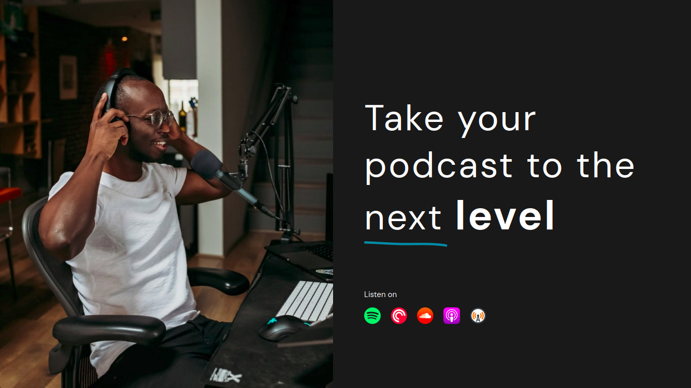
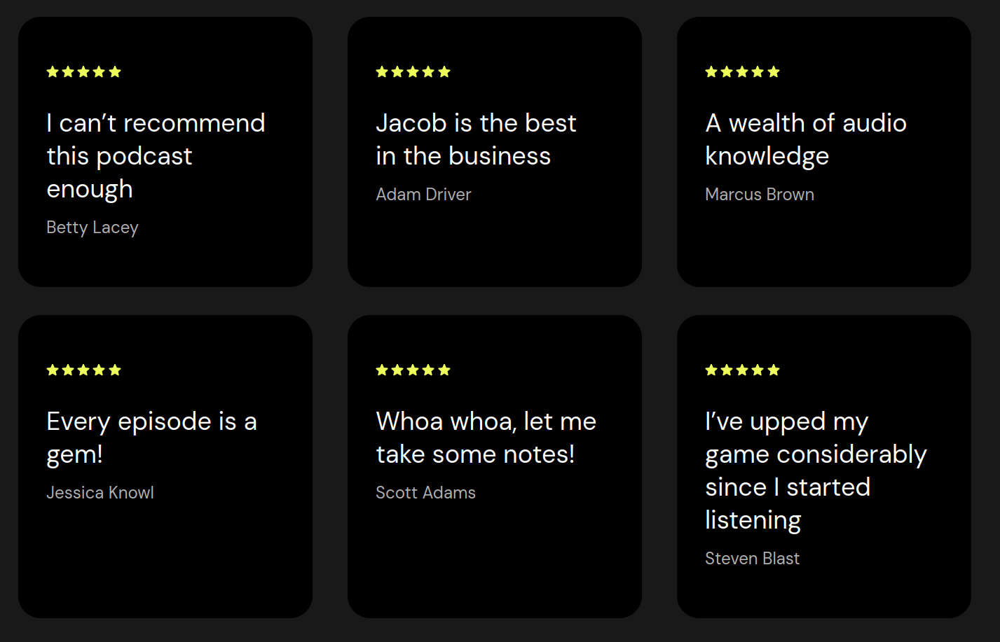
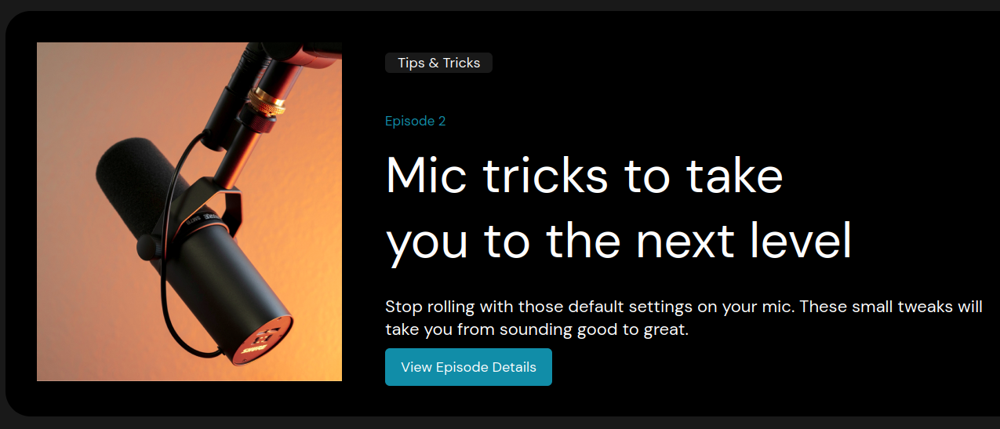

# Castway

Castway is a web project built using HTML and CSS. It is a simple webpage designed to practice layout structuring and styling with pure HTML and CSS.

## 📌 About the Project
This project demonstrates fundamental web development principles, including:
- Structuring HTML code
- Using CSS for styling
- Basic responsiveness techniques

## 🚀 Technologies
- **HTML5** - for page structure
- **CSS3** - for styling elements

## 📸 Preview




## 📂 Project Structure
```sh
castway/
│── index.html    # Main page of the project
│── styles.css    # Stylesheet file
└── assets/       # Directory for images and other resources
```

## 🔧 How to Run the Project

Clone the repository:

```sh
git clone https://github.com/don1yal/Castway.git
```
Open index.html in your browser.

##    📌 Contact

If you have any questions or suggestions, feel free to reach out:

#### GitHub: don1yal

#### Email: orynbekdanial8@gmail.com